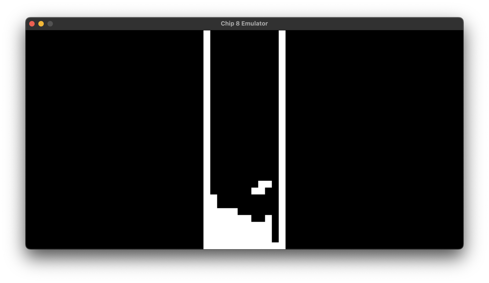
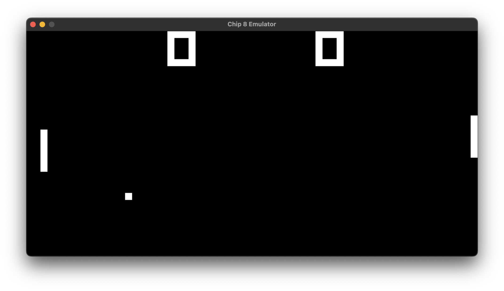
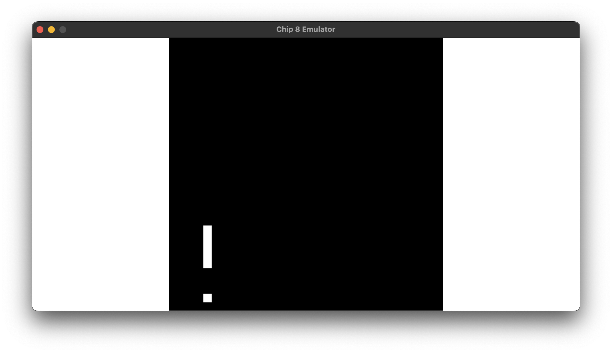
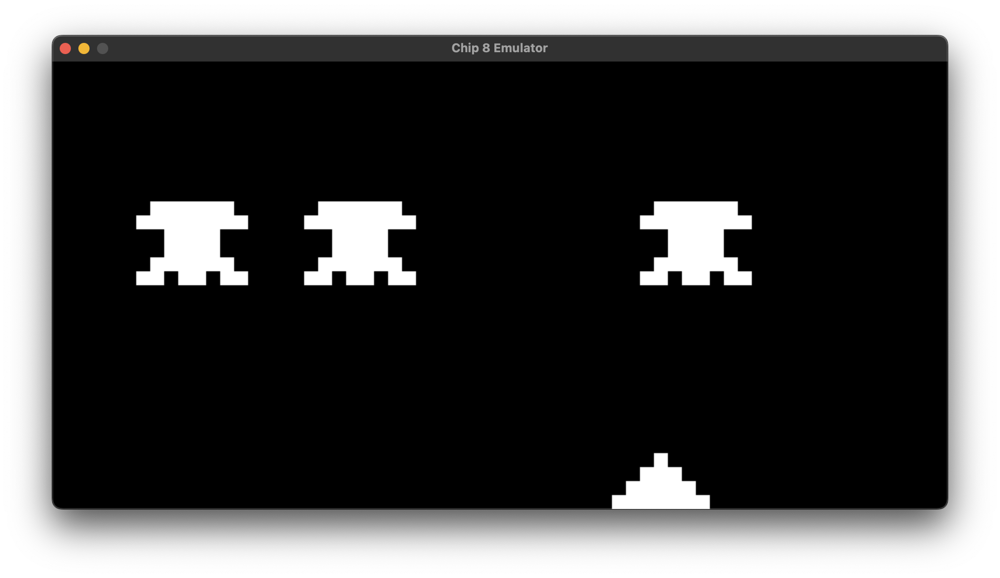

# CHIP-8 Emulator

Another CHIP-8 Emulator written in C using SDL

## Screenshots






## How to Build and Run

This project uses CMake as its build system and has SDL included as a git submodule, so no need to manually clone it :)

### Build

> Note: This assumes you have a C compiler (such as [gcc](https://gcc.gnu.org/) or [clang](https://clang.llvm.org/)), [CMake](https://cmake.org/), and [Git](https://git-scm.com/) installed on your computer.

First, clone the repository and navigate into it:

```bash
git clone --recursive https://github.com/snufflyyy/chip8-emulator.git
cd chip8-emulator
```

Next, create a build directory and enter it:

```bash
mkdir build
cd build
```

Finally, configure the cmake project and build it:

```bash
cmake ..
cmake --build .
```

### Run

To run the emulator just run the executable.

```bash
./Chip8Emulator
```

> Note: Windows users may need to copy the "SDL3.dll" file from "build/external/SDL/" into the root of the build directory for the emulator to start.

## Usage

Once the emulator is open, drag and drop a rom file onto the window to begin.
You can drag and drop a new rom at anytime to begin playing a new game.

### Keybindings

The CHIP-8 originally had a 16-key hexadecimal keypad which looks like this:

```
-----------------
| 1 | 2 | 3 | C |
| 4 | 5 | 6 | D |
| 7 | 8 | 9 | E |
| A | 0 | B | F |
-----------------
```

This emulator follows in the foot steps of many others like it and uses the left half of your keyboard as a replacement, which looks like this:

```
-----------------
| 1 | 2 | 3 | 4 |
| Q | W | E | R |
| A | S | D | F |
| Z | X | C | V |
-----------------
```

## Acknowledgements

  - [SDL](https://www.libsdl.org/) - for providing a simple and easy to use way to create a window and display a texture on it.
  - [Cowgod's Chip-8 Technical Reference](http://devernay.free.fr/hacks/chip8/C8TECH10.HTM) - for providing all the infomation needed to create this emulator.
  - [CHIP-8 Wikipedia Page](https://en.wikipedia.org/wiki/CHIP-8) - for providing additional infomation about the CHIP-8.

Roms used in screenshots

  - [Tetris Rom](https://github.com/kripod/chip8-roms/blob/master/games/Tetris%20%5BFran%20Dachille%2C%201991%5D.ch8)
  - [Pong Rom](https://github.com/kripod/chip8-roms/blob/master/games/Pong%20%5BPaul%20Vervalin%2C%201990%5D.ch8)
  - [Snake Rom](https://steveroll.itch.io/chip-8-snake)
  - [Space Invaders Rom](https://github.com/kripod/chip8-roms/blob/master/games/Space%20Invaders%20%5BDavid%20Winter%5D.ch8)

## License

[MIT](https://choosealicense.com/licenses/mit/)
